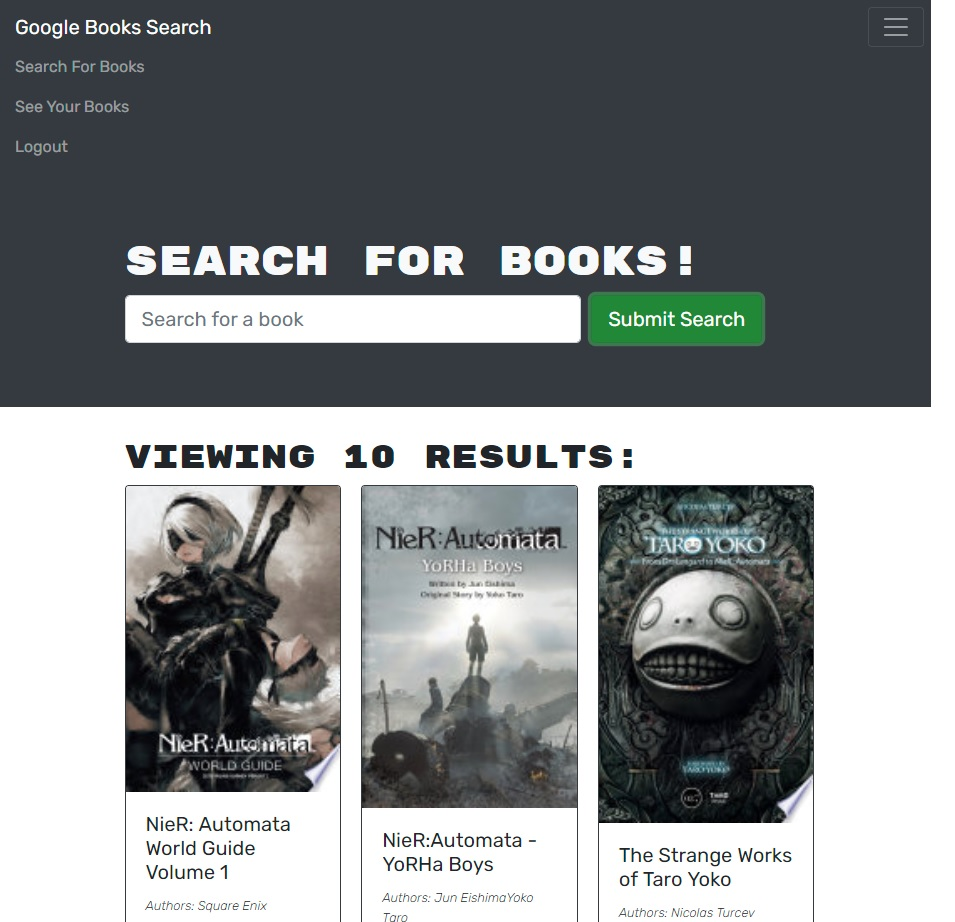

# Book Search

## Description:

---
This is project where I refactored an existing REACT application with REST API server, and updated it run using ApolloClient and GraphQL.

## [Book Search FM](https://book-search-fm.herokuapp.com/)
### https://github.com/Myuze/book-search-fm
---

## Table of Contents:

---
1. [Installation Instructions](#installation-instructions)
2. [Usage](#usage)
3. [Contribute](#contribute)
4. [Licenses](#licenses)
5. [Questions](#questions)

## Installation Instructions:

---
1. Install, `node.js`.
2. Clone the application repository.
3. In the repository root, in the CLI, `npm install`.

## Usage:

---
From the base repository directory:
1. From the CLI use, `npm run develop`.
2. Open the page at `localhost:3000`.

## Contribute:

---
- If you would like to contribute you can contact me on Github or by Email.

## Licenses:

---

**MIT License**
Copyright &#169; 2021

## Questions:

---

### What is your Github username?

[Myuze](https://github.com/Myuze)

### If you have any other questions, you can reach me at:

[flmeneses.dev@gmail.com](mailto:flmeneses.dev@gmail.com)
